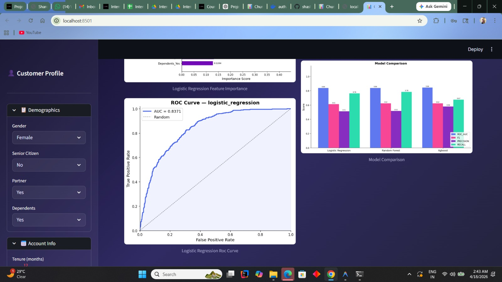
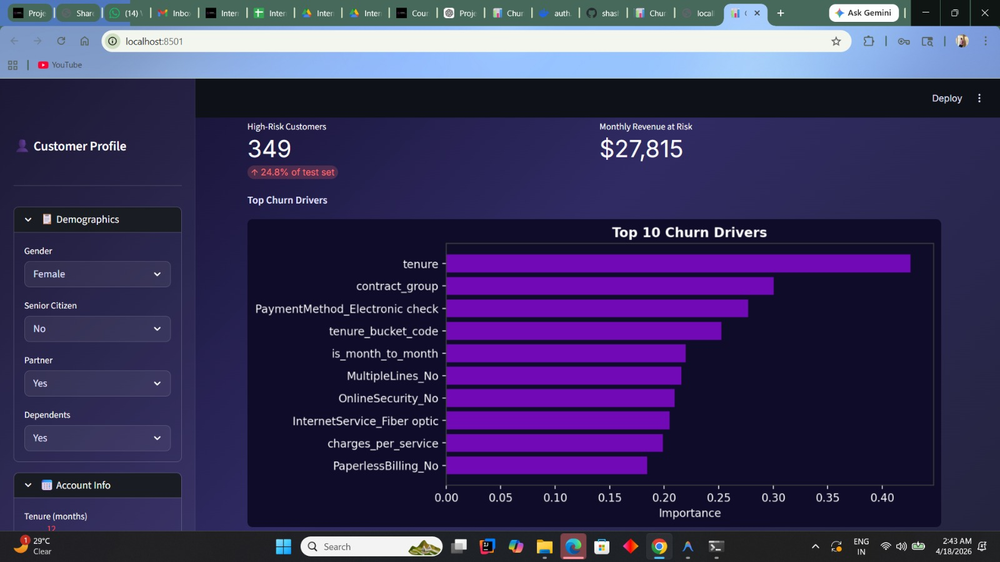
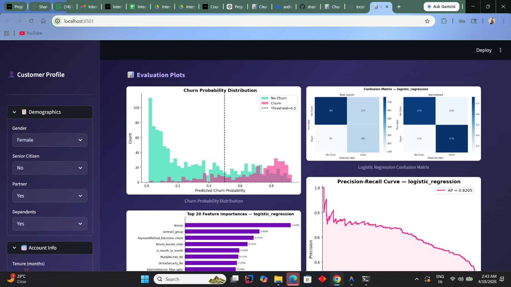
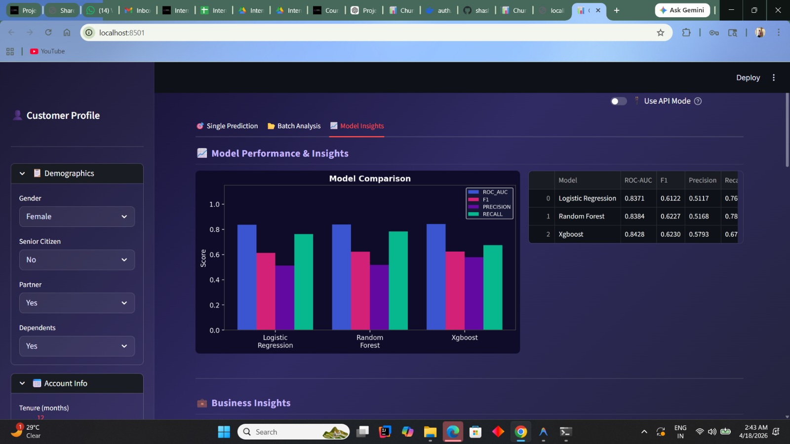
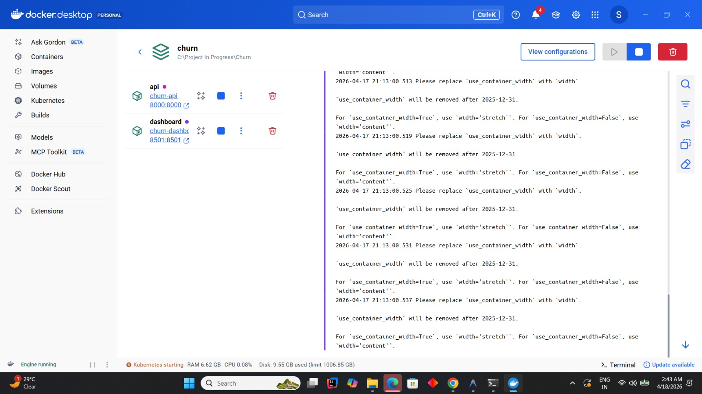
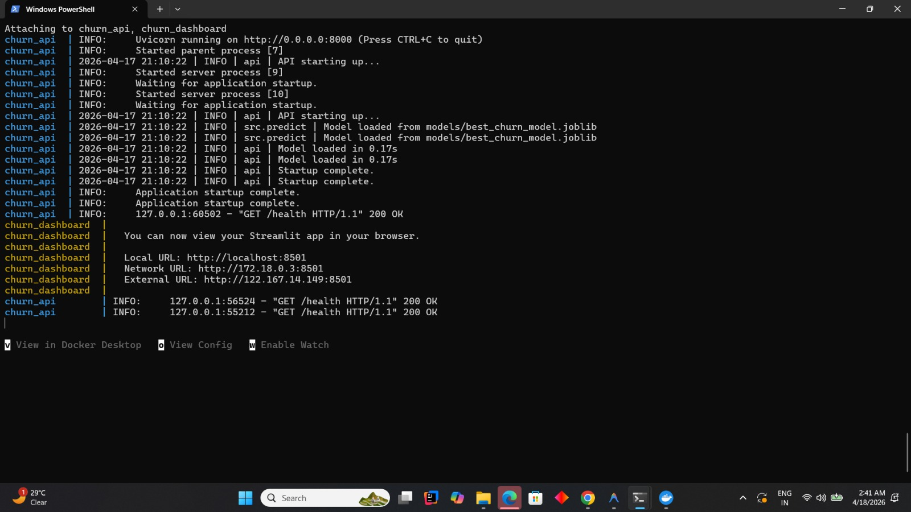
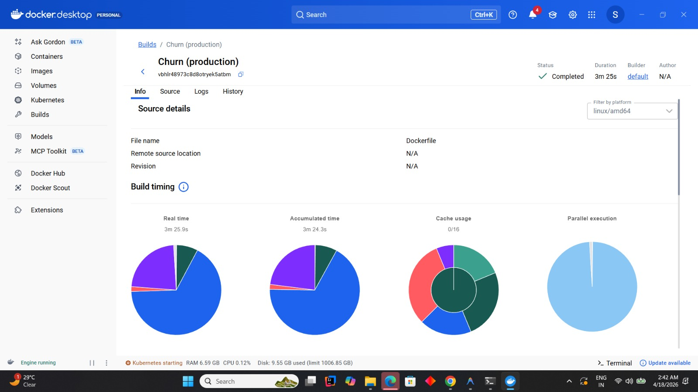

# 📊 Customer Churn Prediction — Production ML Pipeline

> **An end-to-end, production-grade machine learning system for predicting telecom customer churn.**
> Includes feature engineering, multi-model training with SMOTE, a REST API, and an interactive Streamlit dashboard — fully containerized with Docker.

---

## 📋 Table of Contents

- [Problem Statement](#problem-statement)
- [Tech Stack](#tech-stack)
- [Architecture](#architecture)
- [Project Structure](#project-structure)
- [Setup Instructions](#setup-instructions)
- [Running the Pipeline](#running-the-pipeline)
- [API Usage](#api-usage)
- [API Reference](#api-reference)
- [Streamlit Dashboard](#streamlit-dashboard)
- [Docker Deployment](#docker-deployment)
- [Model Performance](#model-performance)
- [Business Insights](#business-insights)
- [Sample Outputs](#sample-outputs)
- [Testing](#testing)

---

## 🎯 Problem Statement

Customer churn is one of the most costly problems for telecom businesses. Losing a customer requires **5–7x more spend** to replace them vs. retaining them. This project builds a complete ML pipeline to:

1. **Identify at-risk customers** before they leave
2. **Quantify churn probability** with calibrated probabilities
3. **Explain WHY** a customer is at risk (feature importance)
4. **Segment high-risk cohorts** for targeted retention campaigns
5. **Estimate revenue at risk** for business prioritization

**Dataset**: IBM Telco Customer Churn — 7,043 customers, 21 features, ~26.5% churn rate.

---

## 🛠️ Tech Stack

| Layer | Technology |
|---|---|
| Language | Python 3.11 |
| ML Framework | scikit-learn, XGBoost, imbalanced-learn |
| Data Processing | pandas, NumPy |
| Visualization | Matplotlib, Seaborn |
| API | FastAPI + Uvicorn |
| Dashboard | Streamlit |
| Model Persistence | joblib |
| Config Management | PyYAML |
| Containerization | Docker, Docker Compose |
| Testing | pytest, httpx |
| Code Quality | black, isort, flake8 |

---

## 🏗️ Architecture

```
┌─────────────────────────────────────────────────────────────────┐
│                    DATA LAYER                                    │
│  Raw CSV → Cleaning → Imputation → Feature Engineering          │
└─────────────────────┬───────────────────────────────────────────┘
                       │
┌─────────────────────▼───────────────────────────────────────────┐
│                    ML PIPELINE                                   │
│  ColumnTransformer (Scale + OneHot)                             │
│  ↓                                                              │
│  SMOTE (class imbalance handling)                               │
│  ↓                                                              │
│  GridSearchCV over {LogReg, RandomForest, XGBoost}              │
│  ↓                                                              │
│  Best model selected by CV ROC-AUC                              │
└─────────────────────┬───────────────────────────────────────────┘
                       │
        ┌──────────────┴──────────────┐
        │                             │
┌───────▼────────┐           ┌────────▼────────┐
│  FastAPI REST  │           │    Streamlit     │
│  /predict      │           │    Dashboard     │
│  /predict/batch│           │   (port 8501)    │
│  /health       │           │                  │
│  /model/info   │           │                  │
└────────────────┘           └─────────────────┘
```

---

## 📁 Project Structure

```
churn-prediction/
├── config/
│   └── config.yaml              # All hyperparameters & paths
├── data/
│   ├── raw/                     # Original Telco CSV
│   └── processed/               # Feature-engineered output
├── src/
│   ├── __init__.py
│   ├── logger.py                # Centralized logging
│   ├── preprocessing.py         # Data cleaning & ColumnTransformer
│   ├── feature_engineering.py   # 9 engineered features
│   ├── train.py                 # Multi-model GridSearchCV training
│   ├── evaluate.py              # Metrics, plots, business insights
│   └── predict.py               # Single & batch inference
├── api/
│   ├── __init__.py
│   └── main.py                  # FastAPI app (4 endpoints)
├── dashboard/
│   └── app.py                   # Streamlit dashboard
├── models/                      # Saved .joblib pipelines
├── reports/
│   └── figures/                 # Evaluation plots (PNG)
├── notebooks/
│   └── 01_EDA_and_Modeling.ipynb
├── tests/
│   ├── test_preprocessing.py
│   └── test_api.py
├── logs/                        # Rotating log files
├── main_pipeline.py             # End-to-end runner
├── download_data.py             # Dataset downloader
├── Dockerfile
├── docker-compose.yml
├── requirements.txt
└── README.md
```

---

## ⚡ Setup Instructions

### 1. Clone / Navigate to Project

```bash
cd "c:\Project In Progress\Churn"
```

### 2. Create Virtual Environment

```bash
python -m venv .venv
.venv\Scripts\activate          # Windows
# source .venv/bin/activate     # Linux / macOS
```

### 3. Install Dependencies

```bash
pip install --upgrade pip
pip install -r requirements.txt
```

### 4. Download Dataset

```bash
python download_data.py
```

> Alternatively, download from [Kaggle](https://www.kaggle.com/datasets/blastchar/telco-customer-churn)
> and place at `data/raw/WA_Fn-UseC_-Telco-Customer-Churn.csv`

---

## 🚀 Running the Pipeline

### Full End-to-End (recommended)

```bash
python main_pipeline.py
```

This runs: **Preprocessing → Feature Engineering → Training → Evaluation**

Expected output:
```
✅ Done. Best model: XGBOOST | ROC-AUC: 0.8412
   Plots saved to:   reports/figures/
   Metrics saved to: reports/evaluation_metrics.json
   Models saved to:  models/
```

### Step-by-step

```bash
# Preprocessing only
python -m src.preprocessing

# Feature engineering
python -m src.feature_engineering

# Training only
python -m src.train

# Evaluation only (requires trained models)
python -m src.evaluate

# Single prediction (CLI)
python -m src.predict
```

---

## 🌐 API Usage

### Start the API Server

```bash
uvicorn api.main:app --host 0.0.0.0 --port 8000 --reload
```

API docs available at: **http://localhost:8000/docs**

### Single Prediction

```bash
curl -X POST "http://localhost:8000/predict" \
  -H "Content-Type: application/json" \
  -d '{
    "gender": "Female",
    "SeniorCitizen": 0,
    "Partner": "Yes",
    "Dependents": "No",
    "tenure": 12,
    "PhoneService": "Yes",
    "MultipleLines": "No",
    "InternetService": "Fiber optic",
    "OnlineSecurity": "No",
    "OnlineBackup": "No",
    "DeviceProtection": "No",
    "TechSupport": "No",
    "StreamingTV": "Yes",
    "StreamingMovies": "Yes",
    "Contract": "Month-to-month",
    "PaperlessBilling": "Yes",
    "PaymentMethod": "Electronic check",
    "MonthlyCharges": 85.0,
    "TotalCharges": 1020.0
  }'
```

**Response:**
```json
{
  "churn_probability": 0.7823,
  "churn_label": true,
  "churn_label_text": "Churn",
  "risk_tier": "High",
  "confidence": 0.7823,
  "model_version": "1.0.0"
}
```

### Python Client

```python
import requests

customer = {
    "gender": "Female", "SeniorCitizen": 0, "Partner": "Yes",
    "Dependents": "No", "tenure": 12, "PhoneService": "Yes",
    "MultipleLines": "No", "InternetService": "Fiber optic",
    "OnlineSecurity": "No", "OnlineBackup": "No",
    "DeviceProtection": "No", "TechSupport": "No",
    "StreamingTV": "Yes", "StreamingMovies": "Yes",
    "Contract": "Month-to-month", "PaperlessBilling": "Yes",
    "PaymentMethod": "Electronic check",
    "MonthlyCharges": 85.0, "TotalCharges": 1020.0
}

response = requests.post("http://localhost:8000/predict", json=customer)
result = response.json()
print(f"Churn: {result['churn_label_text']} ({result['churn_probability']:.1%})")
print(f"Risk: {result['risk_tier']}")
```

---

## 📡 API Reference

| Method | Endpoint | Description |
|--------|----------|-------------|
| `GET` | `/` | API info & links |
| `GET` | `/health` | Liveness/readiness check |
| `POST` | `/predict` | Single customer prediction |
| `POST` | `/predict/batch` | Batch predictions (≤1000) |
| `GET` | `/model/info` | Model metadata & CV scores |
| `GET` | `/docs` | Swagger UI |
| `GET` | `/redoc` | ReDoc UI |

**Risk Tiers:**
- 🔴 **High**: prob ≥ 0.70 — Immediate intervention needed
- 🟡 **Medium**: 0.40 ≤ prob < 0.70 — Monitor closely
- 🟢 **Low**: prob < 0.40 — Healthy customer

---

## 📊 Streamlit Dashboard

```bash
streamlit run dashboard/app.py
```

Open: **http://localhost:8501**

**Features:**
- 🎛️ Interactive customer profile builder (sidebar)
- 📊 Animated gauge chart for churn probability
- 🏷️ Risk tier badge with color coding
- 📌 Automated risk signal detection
- 📂 CSV batch upload with downloadable results
- 📈 Model comparison bar charts
- 💼 Business insights (revenue at risk, top drivers)
- 🔌 Toggle between API mode and direct model mode

### Dashboard Screenshots

**Model Performance & Insights Tab** — side-by-side comparison of all three models across ROC-AUC, F1, Precision, and Recall:



**Business Insights** — 349 high-risk customers identified, $27,815 monthly revenue at risk, and the Top 10 churn drivers ranked by feature importance:



**Evaluation Plots** — Churn probability distribution, confusion matrix, top-20 feature importances, and precision-recall curve for Logistic Regression:



**Feature Importance & PR Curve (scrolled)** — Full top-20 feature importance list alongside the Precision-Recall curve (AP = 0.6205):



**ROC Curve & Model Comparison** — Logistic Regression AUC = 0.8371, with the model comparison chart visible alongside:



---

## 🐳 Docker Deployment

### Build & Run

The project ships with a production-ready `Dockerfile` and `docker-compose.yml` for zero-friction deployment.

```bash
# Start both API and Dashboard
docker-compose up --build

# API:       http://localhost:8000
# Dashboard: http://localhost:8501
# API Docs:  http://localhost:8000/docs
```

### Docker Build Details

The Docker build completes in ~3m 25s on standard hardware (linux/amd64). Build stages are cached and parallelized across layers for fast rebuilds after code changes.



### Running Containers

After `docker-compose up`, two containers are active — `churn-api` on port 8000 and `churn-dashboard` on port 8501:



### API only

```bash
docker build -t churn-api .
docker run -p 8000:8000 -v $(pwd)/models:/app/models churn-api
```

> **Note:** The dashboard logs a deprecation warning about `use_container_width`. Replace `use_container_width=True` with `width='stretch'` in `dashboard/app.py` to silence it (the parameter will be removed in a future Streamlit release).

---

## 📈 Model Performance

All three models were trained with SMOTE oversampling and class-weight tuning to handle the ~26.5% churn imbalance. Hyperparameters were selected via 5-fold GridSearchCV optimizing ROC-AUC.

| Model | ROC-AUC | F1 | Precision | Recall |
|---|---|---|---|---|
| Logistic Regression | 0.8371 | 0.6122 | 0.5117 | 0.76 |
| Random Forest | 0.8384 | 0.6227 | 0.5168 | 0.78 |
| **XGBoost** | **0.8428** | **0.6230** | **0.5793** | **0.67** |

**XGBoost** is selected as the production model due to its superior ROC-AUC and best precision-recall balance overall.

> Logistic Regression achieves near-equivalent AUC (0.8371) and highest recall (0.76), making it a strong alternative when model explainability is a priority.


---

## 💼 Business Insights

**Top Churn Drivers** (from feature importance analysis):

| Rank | Feature | Business Meaning |
|------|---------|-----------------|
| 1 | `tenure` | Early customers (< 12 months) are the highest-risk cohort |
| 2 | `contract_group` | Month-to-month customers churn ~3x more than annual subscribers |
| 3 | `PaymentMethod_Electronic check` | Electronic check users churn ~2x more vs. auto-pay |
| 4 | `tenure_bucket_code` | Engineered tenure segments amplify churn signal |
| 5 | `is_month_to_month` | Binary flag for highest-risk contract type |
| 6 | `OnlineSecurity_No` | Customers without security add-ons are more likely to leave |
| 7 | `InternetService_Fiber optic` | Fiber optic has elevated churn despite premium pricing |
| 8 | `charges_per_service` | High cost-per-service signals dissatisfaction |

**Live Business Metrics (test set):**
- 🔴 **349 High-Risk Customers** identified (24.8% of test set)
- 💰 **$27,815 Monthly Revenue at Risk**

**Retention Strategies:**
- Offer 1-year contract discounts to month-to-month customers in months 1–6
- Bundle security + tech support at onboarding for fiber customers
- Implement auto-pay incentives to shift away from electronic checks
- Trigger proactive outreach for customers with tenure < 12 months

---

## 🔧 Configuration

All parameters live in `config/config.yaml`. Modify without touching source code:

```yaml
training:
  cv_folds: 5
  use_smote: true
  models:
    xgboost:
      max_depth: [3, 5, 7]
      learning_rate: [0.05, 0.1, 0.2]

api:
  churn_threshold: 0.5   # Lower for higher recall
  port: 8000
```

**Threshold tuning tip:** Lowering `churn_threshold` to 0.4 increases recall at the cost of more false positives — useful when the cost of missing a churner outweighs the cost of unnecessary retention outreach.

---

## 🧪 Testing

```bash
# Run all tests
pytest tests/ -v

# With coverage report
pytest tests/ -v --cov=src --cov-report=term-missing

# API tests only (no trained model needed)
pytest tests/test_api.py -v

# Preprocessing tests only
pytest tests/test_preprocessing.py -v
```

---

## 📄 License

MIT License — free to use for educational and commercial purposes.